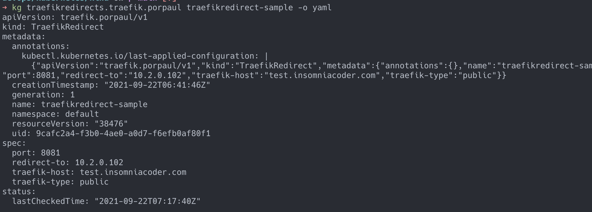
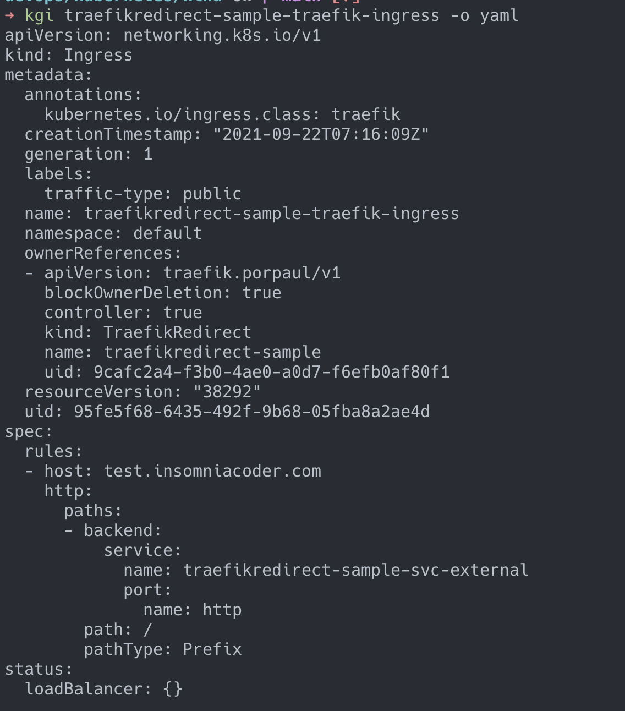
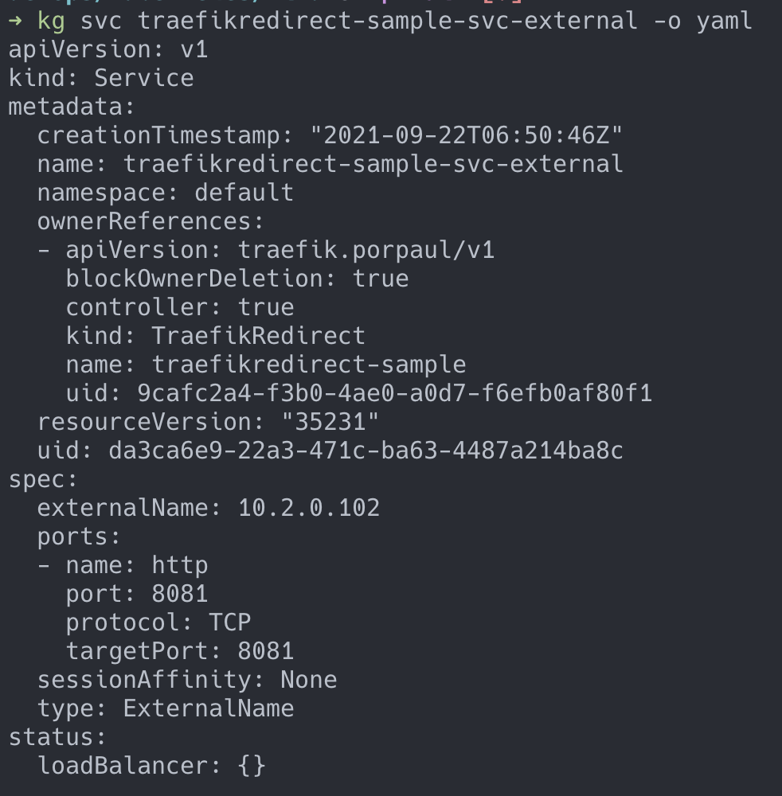

# Overview

Traefik Redirect Operator is used to help creating a combination of Ingress of Traefik controller along with
Service's `ExternalName` type.

The use case for this combination is when you want to create an ingress in Kubernetes to route the traffic to your VMs internally (e.g., EC2 machines).

This scenario is useful when you already have a Traefik controller set up for your Kubernetes cluster serving day to day traffic and you want to utilize it to take care of the traffic to other servers outside of Kubernetes. (for example, www.insomniacoder.com -> 10.2.0.102)

This will save your cost of having dedicated ALB or other cloud-based load balancers that would cost you a fortune if you have too many of them.

# Traffic flow

client -> www.insomniacoder.com (Register in Route53) -> Traefik ALB -> Ingress -> ExternalName service -> 10.2.0.102

# How to use

1. install the operator 
   1. locally
      1. `make docker-build IMG=<image-name>`
      2. `make docker-push IMG=<image-name>`
      3. `make deploy`
2. create the resource following `config/samples/traefik_v1_traefikredirect.yaml`
3. get the resource to check that it is created
   
4. you can see that ingress and service will be created as it should 
   
   